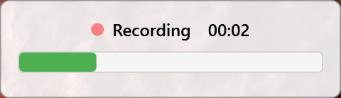

<div align="center">

# 🎙️ VoicePaste

### *Speak. Transcribe. Done.*

[](LICENSE)
[](https://dotnet.microsoft.com/)
[](https://www.microsoft.com/windows)
[](https://python.org)
[](https://developer.nvidia.com/cuda)



**Windows voice dictation that doesn't stop on silence** 🚀

[📥 Download Latest](https://github.com/mykola-dev/voice-agent/releases) · [📖 Documentation](docs/) · [🐛 Report Bug](https://github.com/mykola-dev/voice-agent/issues)

</div>

---

## ✨ What is VoicePaste?

VoicePaste is a **resident system tray application** for Windows that lets you dictate text anywhere using your voice—without annoying auto-stop on silence.

🔴 **Press ScrollLock** → 🎙️ **Speak naturally** → 🟢 **Press ScrollLock again** → 📋 **Text appears instantly**

### 🌟 Key Features

| Feature | Description |
|---------|-------------|
| 🎙️ **Manual Control** | Recording starts/stops only when YOU decide (no silence auto-stop) |
| ⚡ **GPU-Powered** | NVIDIA CUDA acceleration with automatic CPU fallback |
| 🌍 **Bilingual** | Auto-detects English + Ukrainian (no language switching needed) |
| 📋 **Universal Paste** | Works with any app: terminals, editors, browsers, IDEs |
| 🎯 **Always Available** | Runs in system tray—ready whenever you need it |
| 📦 **Portable** | Self-contained build—no installation required |

---

## 🚀 Quick Start

### Prerequisites
- Windows 10 or 11
- NVIDIA GPU with CUDA (optional, for GPU acceleration)

### Installation

#### Option 1: Download Pre-built Release ⭐ Recommended
```bash
# Download from releases page and extract
VoicePaste.exe
```

#### Option 2: Build from Source
```bash
# Clone the repository
git clone https://github.com/mykola-dev/voice-agent.git
cd voice-agent

# Debug build + run
./dev-debug.bat

# Or create portable release
./release-portable.bat
# Output: build/VoicePaste-Release/VoicePaste.exe
```

---

## 🎮 How to Use

1. **Launch** VoicePaste (minimizes to system tray) 📌
2. **Press** <kbd>ScrollLock</kbd> to start recording 🔴
3. **Speak naturally** with pauses—recording continues! 🎙️
4. **Press** <kbd>ScrollLock</kbd> again to stop and transcribe ⏹️
5. **Text auto-pastes** into your currently focused window 📋

### ⚙️ Configuration

Right-click the tray icon → **Settings** to customize:

| Setting | Default | Options |
|---------|---------|---------|
| **Hotkey** | `ScrollLock` | Any key |
| **Paste Shortcut** | `Ctrl+Shift+V` | `Ctrl+V`, `Shift+Insert`, etc. |
| **Model** | `large-v3-turbo` | `large-v3`, `medium`, `small` |
| **Device** | `cuda` | `cuda` (GPU) / `cpu` (CPU) |

---

## 🛠️ Tech Stack

<div align="center">

[]()
[]()
[]()
[]()

</div>

- **Frontend**: C# / WPF (.NET 8.0)
- **STT Engine**: OpenAI Whisper via [faster-whisper](https://github.com/SYSTRAN/faster-whisper)
- **Audio Capture**: WASAPI (NAudio)
- **Platform**: Windows 10/11

---

## 📚 Documentation

| Document | Description |
|----------|-------------|
| [📖 Overview](docs/01-overview.md) | Project goals & requirements |
| [🏗️ Architecture](docs/02-architecture.md) | System components & tech stack |
| [🎨 UX Spec](docs/03-ux-spec.md) | UI behavior & user flows |
| [🎙️ Audio Capture](docs/04-audio-capture.md) | WASAPI recording details |
| [📝 Transcription](docs/05-transcription.md) | Whisper integration |
| [📋 Paste Mechanism](docs/06-paste-mechanism.md) | Clipboard & SendInput |
| [⚙️ Configuration](docs/07-configuration.md) | Settings & config file |
| [🎯 Milestones](docs/08-milestones.md) | Development phases |

---

## 🤝 Contributing

Contributions are welcome! Feel free to:
- 🐛 [Report bugs](https://github.com/mykola-dev/voice-agent/issues)
- 💡 [Suggest features](https://github.com/mykola-dev/voice-agent/issues)
- 🔧 [Submit pull requests](https://github.com/mykola-dev/voice-agent/pulls)

---

## 📄 License

This project is licensed under the **MIT License** - see the [LICENSE](LICENSE) file for details.

---

<div align="center">

Made with ❤️ and 🔊

**[⬆ Back to top](#-voicepaste)**

</div>
